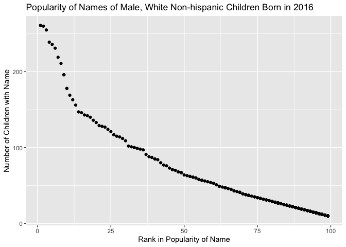

p8105\_hw2\_at3346
================
Ashley Tseng
10/4/2019

## Problem 1

Read and clean the Mr. Trash Wheel sheet:

``` r
trashwheel_data = 
  read_excel("./data/Trash-Wheel-Collection-Totals-8-6-19.xlsx", sheet = "Mr. Trash Wheel", col_names = TRUE, range = "A2:N406") %>% 
  janitor::clean_names() %>% 
  drop_na(dumpster) %>% 
  mutate(
    sports_balls = round(sports_balls), digits = 0,
    sports_balls = as.integer(sports_balls))
```

Read and clean precipitation data for 2017 and 2018:

``` r
precip_2017 = 
  read_excel("./data/HealthyHarborWaterWheelTotals2018-7-28.xlsx", sheet = "2017 Precipitation", col_names = TRUE, range = "A2:B14") %>% 
  janitor::clean_names() %>% 
  drop_na(total) %>% 
  mutate(year = "2017")

precip_2018 = 
  read_excel("./data/HealthyHarborWaterWheelTotals2018-7-28.xlsx", sheet = "2018 Precipitation", col_names = TRUE, range = "A2:B14") %>% 
  janitor::clean_names() %>% 
  drop_na(total) %>% 
  mutate(year = "2018")
```

Combine precipitation datasets for 2017 and 2018 & convert month to a
character variable:

``` r
precip_both = 
  full_join(precip_2017, precip_2018, by = c("year", "month", "total")) %>% 
  mutate(month = month.name[month])
```

The number of observations in the Mr. Trash Wheel dataset is 344. The
average weight of all dumpsters is 3. The median number of sports balls
in a dumpster in 2017 was 8. The number of observations in the combined
precipitation dataset is 19. The average total precipitation across 2017
and 2018 for available data was 3. For available data, the total
precipitation in 2018 was 23.5. For available data, the total
precipitation in 2017 was 32.93.

## Problem 2

Clean the data in pols-month.csv:

``` r
pols_data = 
  read_csv("./data/pols-month.csv", col_names = TRUE) %>% 
  separate(mon, into = c("year","month", "day")) %>% 
  mutate(month = month.name[as.numeric(month)]) %>% 
  pivot_longer(
    cols = starts_with("prez_"),
    names_to = "president",
    names_prefix = "prez_",
    values_to = "party") %>% 
  transform(year = as.numeric(year)) %>% 
  select(-c("day", "party"))
```

    ## Parsed with column specification:
    ## cols(
    ##   mon = col_date(format = ""),
    ##   prez_gop = col_double(),
    ##   gov_gop = col_double(),
    ##   sen_gop = col_double(),
    ##   rep_gop = col_double(),
    ##   prez_dem = col_double(),
    ##   gov_dem = col_double(),
    ##   sen_dem = col_double(),
    ##   rep_dem = col_double()
    ## )

Clean the data in snp.csv:

``` r
snp_data = 
  read_csv("./data/snp.csv", col_names = TRUE) %>% 
  separate(date, into = c("month","day", "year")) %>% 
  mutate(month = month.name[as.numeric(month)]) %>% 
  transform(year = as.numeric(year)) %>% 
  select(year, month, everything(),-c("day"))
```

    ## Parsed with column specification:
    ## cols(
    ##   date = col_character(),
    ##   close = col_double()
    ## )

Clean the data in unemployment.csv:

``` r
unemployment_data = 
  read_csv("./data/unemployment.csv", col_names = TRUE) %>%
  pivot_longer(
    cols = Jan:Dec,
    names_to = "month",
    values_to = "unemployment_pct") %>% 
  mutate(month = match(month, month.abb),
         month = month.name[month]) %>% 
  janitor::clean_names()
```

    ## Parsed with column specification:
    ## cols(
    ##   Year = col_double(),
    ##   Jan = col_double(),
    ##   Feb = col_double(),
    ##   Mar = col_double(),
    ##   Apr = col_double(),
    ##   May = col_double(),
    ##   Jun = col_double(),
    ##   Jul = col_double(),
    ##   Aug = col_double(),
    ##   Sep = col_double(),
    ##   Oct = col_double(),
    ##   Nov = col_double(),
    ##   Dec = col_double()
    ## )

Join snp\_data to pols\_data:

``` r
snp_pols_data = left_join(pols_data, snp_data, by = c("year", "month"))
```

Join unemployment\_data to
snp\_pols\_data:

``` r
un_snp_pols_data = left_join(snp_pols_data, unemployment_data, by = c("year", "month"))
```

“pols\_data” contains 1644 observations and 9 variables related to the
number of national politicians (the president, governors, senators, and
representatives) who are democratic or republican between 1947 and 2015.
A key variable in “pols\_data” is “president” since it indicates the
political party of the president which is interesting given the
distribution of democratic and republican politicians in office at the
time. “snp\_data” contains 787 observations and 3 variables related to
Standard & Poor’s stock market index (S\&P) between 1950 and 2015, often
used as a representative measure of stock market as a whole. A key
variable in “snp\_data” is “closing” since it provides the closing
values of the S\&P stock index on the associated date of observation.
“unemployment\_data” contains 816 observations and 3 variables,
providing the percentage of unemployment in a particular month of the
associated year between 1948 and 2015. A key variable in
“unemployment\_data” is “unemployment\_pct”. The aggregated dataset of
“pols\_data,” “snp\_data,” and “unemployment\_data” is named
“un\_snp\_pols\_data” which contains 1644 observations and 11
variables between 1947 and 2015. Key variables in “un\_snp\_pols\_data”
include “president,” “closing,” and “unemployment\_pct”.

## Problem 3

Load and clean the data in Popular\_Baby\_Names.csv:

``` r
pop_baby_data = 
  read_csv("./data/Popular_Baby_Names.csv", col_names = TRUE) %>% 
  janitor::clean_names() %>% 
  transform(
    gender = tolower(gender),
    ethnicity = tolower(ethnicity),
    childs_first_name = stringr::str_to_title(childs_first_name)) %>% 
  mutate(
    ethnicity = if_else(ethnicity == 'asian and paci', 'asian and pacific islander', ethnicity),
    ethnicity = if_else(ethnicity == 'black non hisp', 'black non hispanic', ethnicity),
    ethnicity = if_else(ethnicity == 'white non hisp', 'white non hispanic', ethnicity)) %>% 
  distinct(year_of_birth, gender, ethnicity, childs_first_name,.keep_all = TRUE)
```

    ## Parsed with column specification:
    ## cols(
    ##   `Year of Birth` = col_double(),
    ##   Gender = col_character(),
    ##   Ethnicity = col_character(),
    ##   `Child's First Name` = col_character(),
    ##   Count = col_double(),
    ##   Rank = col_double()
    ## )

Produce a table showing the rank in popularity of the name “Olivia” as a
female baby name over time:

``` r
olivia_name = 
  pop_baby_data %>% 
  filter(gender == "female", childs_first_name == "Olivia") %>% 
  group_by(ethnicity, year_of_birth) %>% 
  summarize(rank) %>% 
  pivot_wider(
    names_from = year_of_birth,
    values_from = rank
  )
```

Produce a table showing the most popular name among male children over
time:

``` r
male_children = 
  pop_baby_data %>% 
  filter(gender == "male", rank == 1) %>% 
  group_by(ethnicity, year_of_birth) %>% 
  summarize(childs_first_name) %>% 
  pivot_wider(
    names_from = year_of_birth,
    values_from = childs_first_name
  )
```

For male, white non-hispanic children born in 2016, produce a scatter
plot showing the number of children with a name (y axis) against the
rank in popularity of that name (x axis):

``` r
male_white_2016 = 
  pop_baby_data %>% 
  filter(gender == "male", ethnicity == "white non hispanic", year_of_birth == 2016)

mw2016_plot = 
  male_white_2016 %>% 
  ggplot(aes(x = rank, y = count)) + 
  geom_point() +
  labs(
    title = "Popularity of Names of Male, White Non-hispanic Children Born in 2016",
    x = "Rank in Popularity of Name",
    y = "Number of Children with Name")

mw2016_plot
```

<!-- -->

``` r
ggsave("mw2016_plot.pdf")
```

    ## Saving 7 x 5 in image
